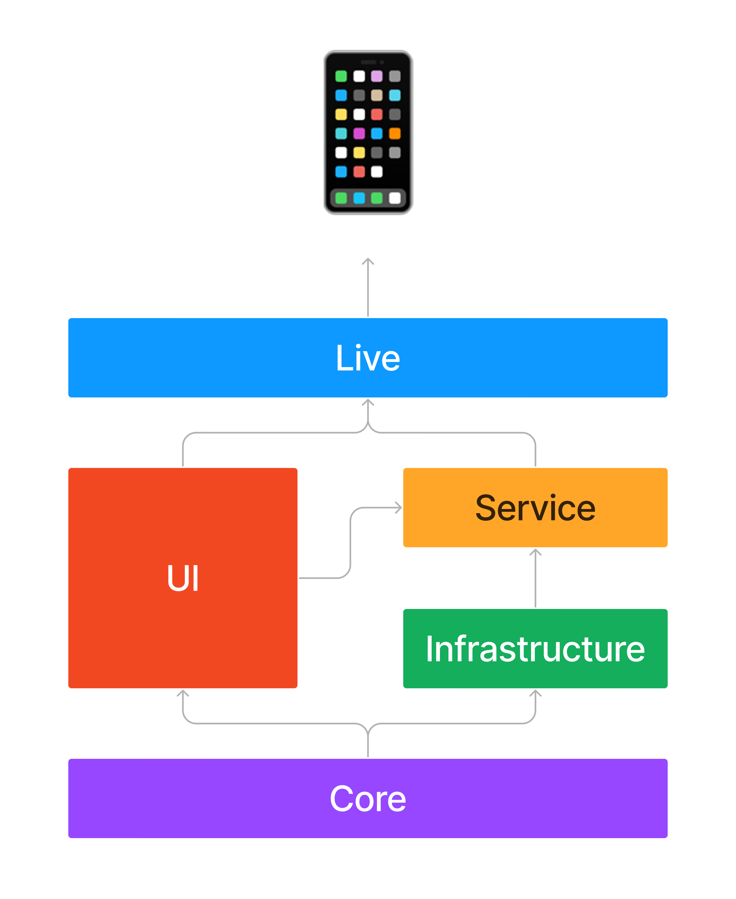

# MVVM-C Template for UIKit Apps

A template to create UIKit applications using the MVVM-C (Model-View-ViewModel-Coordinator) architecture pattern.
Refer to this project for a full implementation: [Anthony-Movie-App](https://github.com/anthony1810/Anthony-Movie-App)



## Table of Contents
- [Introduction](#introduction)
- [Technologies](#technologies)
- [Project Structure](#project-structure)
- [Installation](#installation)
- [Usage](#usage)
- [Contributing](#contributing)
- [License](#license)

## Introduction
This template provides a robust starting point for developing UIKit applications with a clear separation of concerns, ensuring maintainability and scalability. It leverages MVVM-C architecture to manage the app's flow and dependencies efficiently.

## Technologies
This template utilizes the following technologies and frameworks:
1. [MVVM-C](https://www.marcosantadev.com/mvvmc-with-swift/): Model - View - ViewModel - Coordinator
2. [RxSwift](https://github.com/ReactiveX/RxSwift): Reactive programming in Swift
3. [Coordinator pattern](https://github.com/quickbirdstudios/XCoordinator): Navigation management
4. [DifferenceKit](https://github.com/ra1028/DifferenceKit): High-performance diffing algorithm for data changes
5. [Moya/Reactive](https://github.com/Moya/Moya): Network abstraction layer
6. [Kingfisher](https://github.com/onevcat/Kingfisher): Image downloading and caching library
7. [Resolver](https://github.com/hmlongco/Resolver): Dependency injection framework
8. [Lottie-iOS](https://github.com/airbnb/lottie-ios): Animation library for complex animations
9. [SwiftEntryKit](https://github.com/huri000/SwiftEntryKit): Presentation controller for UI elements

## Project Structure
```
├── Models
│ ├── Entities
│ └── Data
├── Views
│ ├── ViewControllers
│ └── CustomViews
├── ViewModels
├── Coordinators
├── Services
│ ├── Network
│ └── Data
├── Resources
│ ├── Assets
│ └── Localizations
├── SupportingFiles
│ ├── AppDelegate.swift
│ └── Info.plist
└── Tests
├── UnitTests
└── UITests
```

## Installation
To use this template, follow these steps:

1. Clone the repository:
   ```sh
   git clone https://github.com/yourusername/your-repo-name.git
   ```
2. Navigate to the project directory:
```sh cd Template ```
3. Install dependencies using CocoaPods:
```sh pod install ```
4. Open the .xcworkspace file in Xcode:
```sh open Template.xcworkspace ```

## Usage

Follow these steps to utilize the template:

1. **Add Models**: Define your data models in the `Models` directory.
2. **Create Views**: Design your user interface in the `Views` directory.
3. **Implement ViewModels**: Write your business logic in the `ViewModels` directory.
4. **Setup Coordinators**: Manage navigation flow in the `Coordinators` directory.
5. **Connect Services**: Implement network and data services in the `Services` directory.

Refer to the included example project for detailed usage and examples.


## Contributing

Contributions are welcome! Please follow these steps:

1. Fork the repository.
2. Create a new branch (`git checkout -b feature/YourFeature`).
3. Commit your changes (`git commit -m 'Add some feature'`).
4. Push to the branch (`git push origin feature/YourFeature`).
5. Open a pull request.

## License

This project is licensed under the MIT License - see the [LICENSE](LICENSE) file for details.


